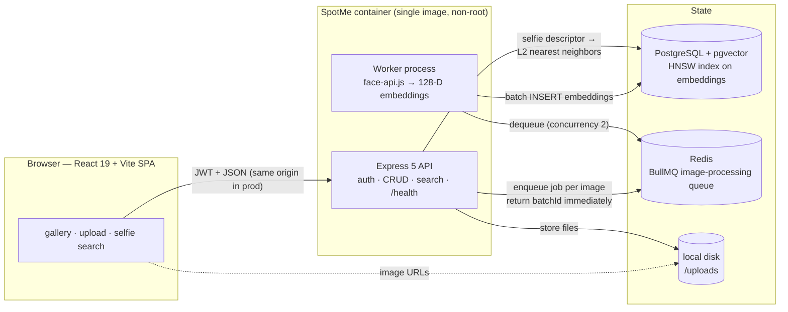

# SpotMe 📸

[](https://github.com/d3vpool/grabPic/actions/workflows/ci.yml)

**Find yourself in any event photo — upload a selfie, get every shot you're
in.** SpotMe is a two-sided AI event photo platform: photographers bulk-upload
event galleries (direct upload or a Google Drive folder link), an async
face-indexing pipeline extracts 128-D face embeddings into Postgres/pgvector,
and guests search with a single selfie — no account needed via public share
links. Face detection, indexing and similarity search all run server-side on
open models (face-api.js), with a HNSW-indexed vector search keeping queries
in the low milliseconds at 100K embeddings.

**Live demo:** _not deployed yet — URL goes here after the first Fly.io
deploy (see [DEPLOY.md](DEPLOY.md))_ <!-- TODO: real live URL -->

<!-- TODO: demo GIF — record after first deploy (signup → upload → selfie search) -->

---

## Features

- 🎉 **Event management** — create/edit/delete galleries, cover images, private by default with an explicit share toggle
- 📤 **Bulk upload** — hundreds of photos per request; rows insert instantly, face indexing runs in a background worker with live progress polling
- 📂 **Google Drive import** — paste a public Drive folder link; server imports images through the same pipeline (public folders only, API-key, no OAuth)
- 🤖 **AI face search** — one selfie → every photo you appear in, with face bounding boxes
- 🔗 **Public share links** — guests search without an account
- 🔒 **Security hardening** — rate limits, magic-byte file validation, helmet, strict CORS, fail-fast env validation

---

## Architecture



**Upload flow:** Multer saves files → `image` rows + an `UploadBatch` insert → one BullMQ job per image → HTTP responds with `{ batchId, totalImages }` in milliseconds → the worker dequeues, runs detection/landmarks/descriptors, batch-inserts embeddings with a single multi-row `INSERT`, and atomically increments the batch counters the frontend polls.

**Search flow:** selfie → **one** ML pass (rejecting zero-face and multi-face inputs with 400s) → 128-D descriptor → pgvector `<->` query scoped to the event's embeddings over the HNSW index → filter at `distance < FACE_MATCH_DISTANCE_THRESHOLD` (0.55, chosen for zero false positives over the F1-optimal 0.60 — see [ACCURACY.md](ACCURACY.md)) → matched URLs + bounding boxes.

### Key design decisions

- **pgvector instead of a separate vector DB** — embeddings are 128-D and only ever searched *within one event*; one database for relational data + vectors means no sync drift, no second backup, and HNSW inside Postgres is more than fast enough at this scale (measured below).
- **Async ingestion via BullMQ** — face detection takes seconds per image; blocking the HTTP request on a 50-image batch meant tens-of-seconds requests that died on client timeout. Decoupling made upload response time independent of ML time, and gave users a progress bar to watch.
- **HNSW index (L2 operator class)** — chosen over IVFFlat because it needs no training step tied to data volume and has better recall at similar speed; the operator class is matched to the `<->` operator used in queries (wrong ops class = silently unused index).
- **Single container for API + worker** — uploads live on local disk and both processes need the same files; splitting them requires shared storage (S3), which is out of scope. A documented demo tradeoff, not a scaling recommendation.
- **Models baked into the image** — face-api weights (12 MB) ship in the container; no download at boot, so cold starts stay fast and the app works offline from the image.

---

## Performance

All numbers below are copied verbatim from [METRICS.md](METRICS.md) — the
source of truth, reproducible via `backend/benchmarks/bench-search.ts`.

Direct-DB vector search latency (Node v22, local Postgres + pgvector, synthetic
random 128-D embeddings, 100 iterations, 5 warmup discarded):

| Embeddings | Index | p50 | p95 | p99 |
|---:|---|---:|---:|---:|
| 1,000 | none | 0.82ms | 1.03ms | 1.38ms |
| 1,000 | HNSW | 0.79ms | 0.98ms | 1.21ms |
| 10,000 | none | 5.23ms | 6.11ms | 7.85ms |
| 10,000 | HNSW | **1.09ms** | 1.38ms | 1.82ms |
| 100,000 | none | 40.97ms | 46.27ms | 50.72ms |
| 100,000 | HNSW | **1.15ms** | **1.71ms** | 2.68ms |

- **4.8× faster p50 at 10K** embeddings; **35.6× faster p50 / 27× faster p95 at 100K** — zero application-layer changes, confirmed via `EXPLAIN ANALYZE` (`Index Scan using face_embedding_vector_hnsw_idx`).
- HNSW build time: **0.94s at 10K**, **47.75s at 100K** (exceeds default `maintenance_work_mem`; Postgres logs a notice and completes).
- A second no-index run at 100K measured 39.0ms p50 (run-to-run variance) — both runs are recorded in METRICS.md.
- **Upload time-to-response (measured 2026-09-23, `bench:upload`):** p50 **16.4ms / 36.5ms / 152.9ms** for 1 / 10 / 50 images — the endpoint returns immediately while indexing runs in the worker. Caveat: the bench fixture has no image data, so the *E2E* rows measure the decode-failure + retry-backoff path, **not** face-processing throughput (METRICS.md says exactly that). Nothing is claimed here that isn't measured.

## Accuracy — honest status

**The face-match threshold is empirically measured (2026-10-04).**
`FACE_MATCH_DISTANCE_THRESHOLD = 0.55` comes from `npm run bench:accuracy`
on a labeled LFW fixture (8 identities × 6 photos → 946 pairs) and is a
deliberate product choice: **precision 1.000 / recall 0.940 / F1 0.969 —
zero false positives** across all 846 different-person pairs. The F1-optimal
point was 0.60 (F1 0.970, precision 0.961) but was deliberately not
shipped — showing a guest a stranger's photo is worse than a missed match,
and the ΔF1 (0.001) is within noise. Caveat: N is small (8 identities) and
LFW is curated near-frontal single-face data, so this is measured-on-fixture,
not production-grade validation. Full sweep, tradeoff table, fixture
citation, and limitations in [ACCURACY.md](ACCURACY.md).

---

## Quick start (Docker)

One command from a clean clone (Docker + Compose v2, or the `docker-compose`
v1 binary):

```bash
git clone https://github.com/d3vpool/grabPic.git
cd grabPic
docker compose up --build
# → http://localhost:3000  (SPA + API in one container; Postgres + Redis alongside)
```

The container entrypoint waits for Postgres, runs `prisma migrate deploy`
(creates schema, pgvector extension, HNSW index), then supervises the API and
worker — if either dies, the container exits so Compose/Fly restarts it.

Optional demo data (bring your own photos — see the privacy note below):

```bash
docker compose cp ./my-photos app:/tmp/photos
docker compose exec -w /app/backend app npx tsx scripts/seed-demo.ts --photos=/tmp/photos
```

### Local development (split workflow)

Compose runs **infra only**; the API, worker and Vite run on the host:

```bash
# 1. Infra
docker compose up postgres redis

# 2. Backend (two processes — API + worker)
cd backend
cp .env.example .env          # fill in values; JWT_SECRET: openssl rand -hex 32
npm install
npm run dev                   # API on http://localhost:3000
npm run worker                # in a second terminal — BullMQ worker

# 3. Frontend
cd frontend
cp .env.example .env          # VITE_API_URL=http://localhost:3000
npm install
npm run dev                   # http://localhost:5173
```

> No separate `prisma migrate dev` step is needed on a fresh **compose** database — the container entrypoint runs `prisma migrate deploy` on boot. (Run `npx prisma migrate dev` by hand only when you're developing a schema change.)

## Environment variables

All backend variables are validated at startup (Zod) — the server refuses to
boot with missing/invalid values, and in production additionally refuses
placeholder-looking secrets. See [`backend/.env.example`](backend/.env.example)
for the full annotated list and [`DEPLOY.md`](DEPLOY.md) for production values.

| Variable | Required | Notes |
|---|---|---|
| `DATABASE_URL` | ✅ | Postgres with pgvector |
| `JWT_SECRET` | ✅ | ≥ 32 chars; production rejects placeholders |
| `GOOGLE_DRIVE_API_KEY` | ✅ | needed to boot; only used by Drive import |
| `REDIS_URL` | default `redis://localhost:6379` | BullMQ backend |
| `PORT` | default `3000` | |
| `FRONTEND_URL` | default `http://localhost:5173` | CORS origin; same-origin in prod |
| `NODE_ENV` | — | `production` enables SPA serving + secret gate |
| `PUBLIC_URL`, `DEMO_PASSWORD` | scripts only | used by `seed:demo` |

Uploads are stored on **local disk at `backend/uploads/`** (in the container:
`/app/backend/uploads`) — not env-configurable; mount a volume there.

## API

All responses use one envelope: success `{ success: true, data, message? }`,
error `{ success: false, error: { message, code? } }`.

| Method | Endpoint | Auth | Description |
|---|---|---|---|
| `POST` | `/user/signup` · `/user/login` | — | JWT auth |
| `POST` | `/events` | ✅ | create event (optional cover image) |
| `GET` | `/events` · `/events/:eventId` | ✅ | list / fetch own events |
| `PATCH` | `/events/:eventId` | ✅ | update title/description |
| `PATCH` | `/events/:eventId/visibility` | ✅ | toggle `isPublic` |
| `DELETE` | `/events/:eventId` | ✅ | cascade delete (embeddings → images → batches → event → files) |
| `POST` | `/events/:eventId/images` | ✅ | bulk upload → `{ batchId, totalImages }` |
| `POST` | `/events/:eventId/images/import-drive` | ✅ | import a public Drive folder |
| `GET` | `/events/:eventId/upload-status/:batchId` | ✅ | poll indexing progress |
| `DELETE` | `/events/:eventId/images/:imageId` | ✅ | delete one image |
| `POST` | `/events/:eventId/search` | ✅ | selfie search (private event) |
| `GET` | `/events/share/:shareToken` | — | public gallery (event must be public) |
| `POST` | `/events/share/:shareToken/search` | — | selfie search (public) |
| `GET` | `/health` | — | DB + Redis health (503 when down) |

---

## Testing & CI

```bash
cd backend
npm test              # run once (CI mode) — separate spotme_test DB, never dev data
npm run test:watch    # watch mode
npm run lint          # ESLint (0 errors)
npm run format:check  # Prettier
```

**Covered (48 tests):** auth flows incl. email-enumeration-safe 401s · event
CRUD · **cross-user ownership enforcement** · cascade-delete regression
(images + embeddings + batches) · Zod input-validation regressions · rate-limit
429 wiring · magic-byte file rejection · threshold-constant guard ·
embedding-insert SQL regression · worker retry-counting guard · pipeline E2E
(local-only, needs a face fixture — see below).

**Not covered (honestly):** frontend component tests (none yet) · face-matching
*accuracy* (separate `bench:accuracy` script — measured 2026-10-04 on an
8-identity LFW fixture, not wired into CI; see [ACCURACY.md](ACCURACY.md)) · the search
endpoint's **zero-face/multi-face validation has no unit test** (only the local
pipeline E2E exercises search at all) · **Google Drive import has no test** ·
`POST /events` with a missing `description` returns 500, not 400 (audit finding,
unfixed). The async upload-polling integration runs only when a local fixture is
present — see below.

**Local-only pipeline E2E:** `test/pipeline-e2e.test.ts` drives a real photo
through upload → worker → embeddings → search. Real face photos can't be
committed, so it SKIPs unless you create `backend/test/fixtures-local/selfie.jpg`
(gitignored) — then `npm test -- pipeline-e2e` runs it. It's a *plumbing* check
(the Day 7 insert-bug regression), not an accuracy check. CI stays green without
the fixture.

CI (`.github/workflows/ci.yml`, on push/PR to `main`): **backend** — lint +
tests against Postgres(pgvector) + Redis service containers · **frontend** —
lint + build · **docker** — build-only image build (no push). Any failure
fails the check.

---

## Security

Implemented:

- **Rate limiting** (`express-rate-limit`, per IP): auth 5/15min, search
  10/min (ML cost + enumeration), upload 20/hr; standardized 429 envelope;
  bypassed under `NODE_ENV=test`.
- **Magic-byte file validation** — a `.jpg` that's really text/exec is
  rejected with 400 *before* it reaches the queue (direct upload, cover
  image, and Drive import all check actual content, not reported MIME).
- **Helmet** security headers, with one scoped exception: the default
  `Cross-Origin-Resource-Policy: same-origin` blocked the frontend from
  loading `/uploads` images cross-origin in dev — fixed by an override on
  that route only, not by disabling helmet (see Limitations).
- **CORS**: single explicit origin from `env.FRONTEND_URL` + `credentials:
  true` — never a wildcard; in production the SPA is served same-origin so
  CORS isn't involved at all.
- **JWT auth** (bcrypt hashes, ≥32-char secret enforced by startup Zod
  schema; production additionally rejects placeholder secrets).
- **Zod validation** on every auth/event route (body, params, query).
- **Container hygiene**: non-root runtime user (gosu privilege drop after
  volume/migration setup), prod-only dependencies, `/health` probe.

Tradeoffs (deliberate, documented):

- **IP-based rate limits** — everyone behind one NAT shares a bucket.
- **JWT 7-day expiry, no refresh-token flow** — shortening without refresh
  would mean constant re-logins; refresh tokens are the right fix, out of scope.
- **In-memory rate-limit store** — resets on restart, per-instance; fine for
  one instance, wrong for horizontal scale.
- **No per-account event/image quotas** — upload rate limits slow abuse but
  don't cap disk usage per account (see Limitations).

## Privacy note (public demos)

A public demo that stores face embeddings is sensitive. If you deploy this:

- **Only upload photos of people who have consented** to being in them.
- **Demo data may be wiped periodically.**
- Existing protections: tiered rate limits, magic-byte validation, 10 MB/file
  cap, 200-image cap per Drive import, non-root container. Missing: per-account
  storage quotas (listed below).

The upload/search UI carries this notice inline.

## Known Limitations

Specific, not hand-waved:

1. **Local-disk uploads → single instance.** No object storage; API and
   worker must share a machine *and* a filesystem — the reason they share one
   container. Scaling out requires S3/R2 first.
2. **Face-match accuracy: measured, but small-N.** Threshold 0.55 (a
   zero-false-positive product choice over the F1-optimal 0.60) comes from
   an 8-identity LFW fixture (F1 0.969 / precision 1.000 / recall 0.940 —
   ACCURACY.md); 44 embeddings can't substitute for production-scale
   validation. The 4.8×/35.6× numbers are *latency*, not accuracy.
3. **Drive import: public folders only** (API key, no OAuth for private
   folders), max 200 images/10 MB each, and re-importing the same folder
   duplicates images (no content dedup).
4. **The Day 5 CORS/CORP lesson:** helmet's default
   `Cross-Origin-Resource-Policy: same-origin` passed every automated test
   yet broke cross-origin image rendering in the browser — backend suites
   can't catch browser header semantics. Fixed with a route-scoped override;
   kept as a reminder that "tests green" ≠ "renders correctly."
5. **No account quotas** — no cap on events or total images per account;
   an attacker inside the rate limits can still fill the volume.
6. **Single-container blast radius** — a worker crash takes the API down
   with it (and vice versa); acceptable for a demo, wrong for production.
7. **Ephemeral JWT in local Compose** — `docker compose up` generates a
   random secret per boot (never ships a forgeable default), so sessions
   don't survive container recreation. Set `JWT_SECRET` to fix.
8. **Evidence gaps:** upload *E2E with real faces* is still unmeasured (the bench
   fixture can't decode — METRICS.md documents this precisely); the CI badge
   reflects a workflow that passes `actionlint` but has never run on GitHub; no
   frontend tests; Drive import untested.
9. **`@tensorflow/tfjs-node` is installed but never imported** (Post-Day-7 audit)
   — inference runs the pure-JS tfjs backend. Wiring the native backend in is a
   straightforward perf win, but it changes the memory profile — re-measure
   `fly.toml` sizing afterwards.
10. **`POST /events` without `description` 500s** instead of 400 — Zod marks it
   optional, the Prisma column is NOT NULL (audit finding, not yet fixed).
11. **Google Fonts CDN** is loaded by the SPA (disclosed: external request on
    every page view).

## Roadmap

- [x] Background job queue for face processing (BullMQ + Redis)
- [x] pgvector HNSW index (4.8× @10K / 35.6× @100K p50, measured)
- [x] Automated tests + CI + containerized one-command run
- [ ] Cloud storage for uploads (S3 / R2) → unlock multi-instance
- [ ] Empirically validate the face-match threshold (ACCURACY.md)
- [x] Record upload time-to-response numbers (bench:upload, 2026-09-23) — real-face E2E throughput still pending
- [ ] Multiple face matches per event per search
- [ ] Email / SMS share link delivery
- [ ] Admin dashboard with event analytics
- [ ] Google Drive OAuth flow for private folders

---

## Project history

- **Started:** March 16, 2026 · **Status:** active development
- Day-by-day log: [PROGRESS.md](PROGRESS.md) · decisions: [DECISIONS.md](DECISIONS.md) ·
  numbers: [METRICS.md](METRICS.md) · accuracy: [ACCURACY.md](ACCURACY.md) ·
  deploy: [DEPLOY.md](DEPLOY.md)

## License

MIT © SpotMe
